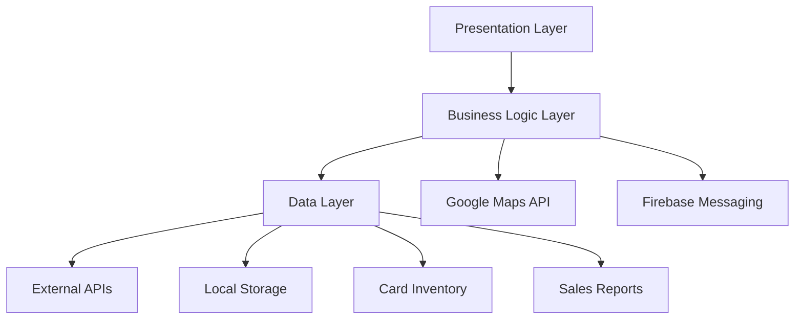
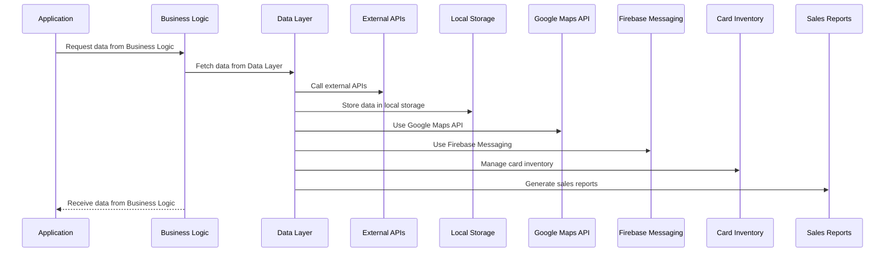
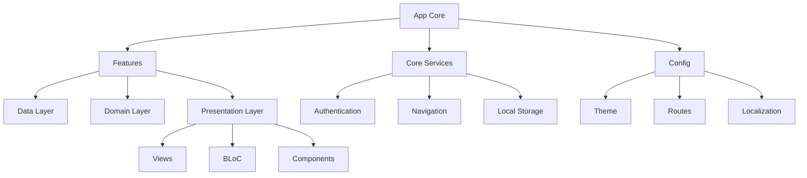
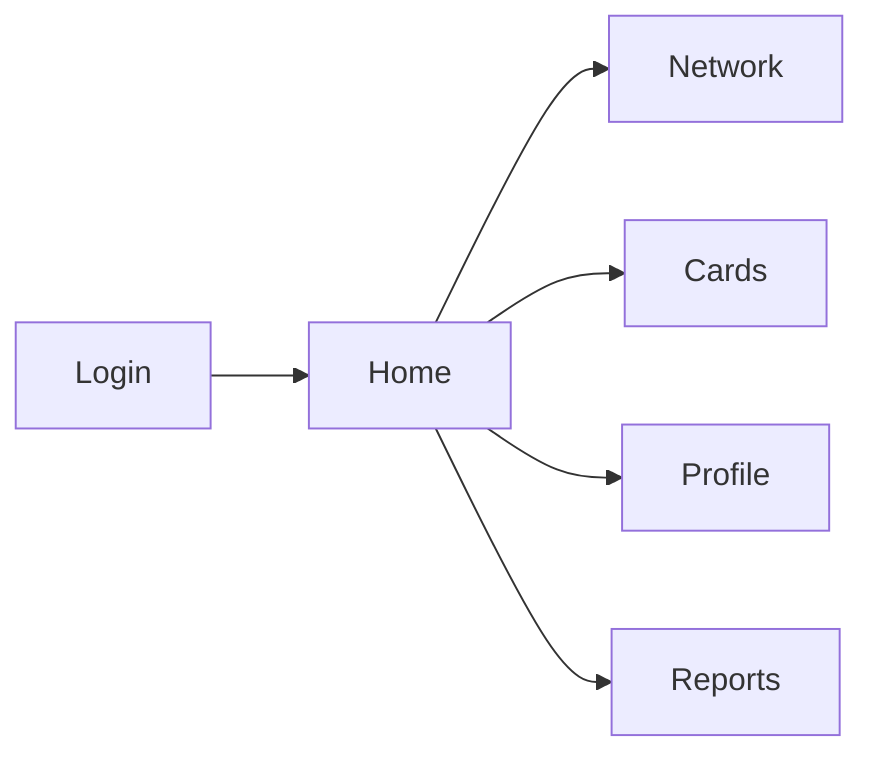
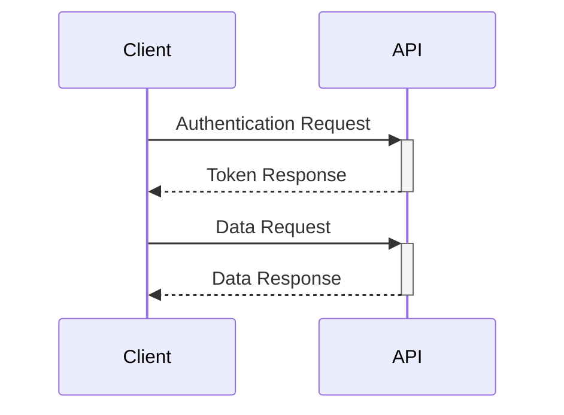

# Recharge Cards App 


<!-- PROJECT LOGO -->
<div align="center">
  
  
  <h1>Recharge Cards Management App</h1>
  
  <p>
    A comprehensive solution for managing recharge cards for service providers and customers
  </p>

  <div>
    <a href="#">
      
    </a>
    <a href="#">
      
    </a>
  </div>
</div>

## About The Project
The recharge cards app provides an innovative solution for purchasing recharge cards digitally without the need for physical cards, with additional features such as:
✔ Track past purchases 
✔ Exclusive offers 
✔ Receive cards instantly on your mobile 
✔ Avoid the hassle of losing cards
## 📱 App Screenshots

<div align="center">
  <table>
    <tr>
      <td></td>
      <td></td>
      <td></td>
      <td></td>
    </tr>
    <tr>
      <td></td>
      <td></td>
      <td></td>
      <td></td>
    </tr>
  </table>
</div>

## ✨ Key Features

- 🔍 Discover nearby available networks
- 💳 Purchase network cards from any provider
- 🛡️ Secure card storage with encryption
- 📊 Comprehensive purchase history tracking
- 🔔 Real-time notifications for promotions
- 🗺️ Network location visualization
- 📦 Easy-to-use purchase process
- 🌙 Dark mode support

## 🛠 Core Technical Features

- **Backend**: Node.js with Express
- **Database**: MongoDB with Redis caching
- **Authentication**: Email/Password & Google Sign-In
- **Notifications**: Firebase Messaging + Flutter Local Notifications
- **State Management**: BLoC Pattern
- **UI**: Fully responsive with advanced animations
- **Maps**: Google Maps integration
- **API**: RESTful with Dio client

## 🛠️ Development Skills Applied

### Backend Development
- Node.js with Express framework
- MongoDB database design
- Redis for caching and performance
- RESTful API development
- JWT authentication

### Mobile Development
- Flutter with Clean Architecture
- BLoC state management
- Firebase Messaging integration
- Flutter Local Notifications
- Google Maps integration
- Advanced animation implementation
- Dio for network operations
- Responsive UI design

### Tools & Methodologies
- Postman for API testing
- Project requirement planning
- Clean Architecture implementation
- Git version control
- Agile development

## 🧩 Application Structure (Clean Architecture)
```
lib/
├── core/
│ ├── constants/
│ ├── errors/
│ ├── network/
│ ├── usecases/
│ └── utils/
├── features/
│ ├── auth/
│ │ ├── data/
│ │ ├── domain/
│ │ └── presentation/
│ ├── networks/
│ │ ├── data/
│ │ ├── domain/
│ │ └── presentation/
│ ├── settings/
│ │ ├── data/
│ │ ├── domain/
│ │ └── presentation/
│ ├── reports/
│ │ ├── data/
│ │ ├── domain/
│ │ └── presentation/
│ ├── card/
│ │ ├── data/
│ │ ├── domain/
│ │ └── presentation/
│ └── purchases/
│ ├── data/
│ ├── domain/
│ └── presentation/
├── injection_container.dart
└── main.dart
```


## 🏛 Technical Architecture


## 📊 Project Workflow



<div align="center">
  
  
  # Crotty - Digital Card Management System
  
  *Revolutionizing Digital Card Transactions*
</div>

## 📱 Overview

Crotty is a modern, feature-rich mobile application designed to simplify and streamline network card management and financial operations. It provides users with a seamless experience for buying, selling, and tracking network cards, as well as handling money transfers and reports. The app is built with scalability, security, and user-friendliness in mind.

---

## 🏗️ Project Architecture



## 🛠️ Technology Stack

<div align="center">

| Category | Technology |
|----------|------------|
| Framework | Flutter |
| State Management | BLoC Pattern |
| Backend Integration | Firebase |
| Local Storage | SQLite |
| Push Notifications | Firebase Cloud Messaging |
| Authentication | Firebase Auth |

</div>

## 📦 Key Dependencies

```yaml
dependencies:
  flutter_bloc: ^8.0.0
  firebase_core: ^2.0.0
  firebase_messaging: ^14.0.0
  flutter_screenutil: ^5.0.0
  dartz: ^0.10.0
  awesome_dialog: ^3.0.0
  equatable: ^2.0.0
```

## 🔑 Core Features

### 1. Authentication System
- Multi-step user verification
- Profile management
- Biometric authentication

### 2. Card Management
- Digital card purchasing
- Transfer system
- Transaction history

### 3. Network Features
- Coverage area tracking
- Package management
- Search functionality

### 4. Reporting System
- Export capabilities
- Import tracking
- Analytics dashboard

## 🎨 UI Components

### Theme System
- Dynamic theme switching
- RTL support
- Responsive design

### Custom Widgets
- Reusable components
- Animated transitions
- Custom dialogs

## 📱 Screen Architecture



## 🔐 Security Features

- Secure token management
- Encrypted storage
- Session handling
- Biometric integration

## 🌐 API Integration



## 📊 State Management

The application uses BLoC pattern for state management:
- Clear separation of concerns
- Predictable state changes
- Easy testing capabilities


## 📱 Supported Platforms

- iOS 11.0+
- Android 5.0+

## 🔄 Project Structure

```
lib/
├── app.dart
├── main.dart
├── core/
│   ├── services/
│   ├── extensions/
│   └── widgets/
├── features/
│   ├── data/
│   ├── domain/
│   └── presentation/
└── config/
    ├── theme/
    ├── routes/
    └── l10n/
```

## 🧪 Testing

The project includes:
- Unit tests
- Widget tests
- Integration tests

## 📈 Performance Optimization

- Image caching
- Lazy loading
- Memory management
- Widget rebuilding optimization

## 🌍 Localization

- Arabic language support
- RTL layout support
- Dynamic locale switching

## 📖 Additional Resources

- [API Documentation](docs/api.md)
- [Contributing Guidelines](CONTRIBUTING.md)
- [Change Log](CHANGELOG.md)

---

<div align="center">
  <p>Built with ❤️ by the Crotty Team</p>
  <p>Copyright © 2024 Crotty. All rights reserved.</p>
</div>
```
